# Emmekit for VBA
A tool kit for reading, manipulating, and writting INRO EMME files

This tools were developed over the years working with EMME. They were originally in Fortran and I ported them to VBA so I could share with my coleagues...
 usually with strict instructions (and with me around).

The utilities are for reading reports and fit them in Excel spreadsheets for further analisys and fitting looks into final documents, but mainly for network 
manipulations -- including previous races data -- that, among others, include:
- Detour/cut/extend (some/all/within a distance) lines to terminal or corridor
- Create integration fare terminals every first transit lines encounter (and closer encounter among routes and centroids)
- Import GPX files and compute observed speeds to the links
- Read GTFS feeds and draw network from it (which required the bellow)
- Map matching (you have a line and a map, and have to decide if that line fits in the map and where... or does it go to a street that is not there).

In 2012, when I saw I needed to clean up the code in order to make it easily re-usable and articulated, I shifted to Haxe, 
under [Jonas](https://github.com/jonasmalacofilho) guidance. While the [EmmeKit for Haxe](https://github.com/jonasmalacofilho/emmekit.hx) is more powerfull also for share,
 using it has a considerably larger barrier, so I was asked by a few coleagues to organize this (so they don't need to bother me anymore to do my magic).

This was prepared within a few days, so I could announce the fufilling of my promise in the INRO Model City São Paulo 2015 (on Sept 1st) in the hope to reach a larger
audience...

... So this is an attempt to bring VBA code to git and document it, working around Excel by exporting the VBA modules, so we can see changes as texts.
This exported modules, which receive the extension ".bas" (".cls" for class modules) are exactly the edited code plus a single header line. You can import and export modules one
 by one, right clicking them on Project Explorer ([see first time user of VBA](#first-time-user)) or use a toll for that in the [module Modules](module-modules)

To do so, I organized (thus far only two) tools in a way that one can use without knowing anything about the code, one is very simple and the other
 is very complex (although not as complex as it can be when real applications are made). 

If you understand how these works, then you got a hold of
 what the code should look like, follow it and then create your own tools (even if you are a [first time user of VBA](#first-time-user)), and hopefully and share them here.

<a name="overall-workflow"></a>
##Overview
You can download only the .xlsm file check and run the code. (to test you need to get the 2 input files in exampledata/database too).
 To contribute, you shall change and add your code in the xlsm and export it to a ".bas" in the directory "modules" or update you shall change the ".bas"
 in the folder modules (see [module Modules](module-modules)

This manipulation tools work as almost all programming tools:

- Learn what and where are the input and output
- Read input
- Do stuff
- Output 

Usually, the input and/or the output are EMME formatted files. In the "do stuff" part, ideally a program must check if the input is what it
 should be and if it is consistent internally and with other input. According with the proposal of this tools, this is usually only checked
(sometimes not even that);
figuring out what is wrong and solving it is let to the user.

When you are writting your own code, you will addapt it to fix it according to 
specific needs... ideally you should do it as a new and independent tool, so you can use it later and share. 

<!--- When you do a patch, as I used to
 and that is the main reason why making generic macros are much harder than making specific ones.
--->


<a name="play-withorganized-tools"></a>
## Playing with the available prepared and organized tools:

The 2 tools available in spreadsheet have the same organization, that we used in practice, to keep a record of what has been done to generate every file:

- Each column on the spreadsheet represents one race of the tool
- So each row, represents one diferent input (or output) parameter
- By pressing the button 'RUN' the macro will excute for every column where an 'X' indicates to do so.
- BEFORE running the first time, Network parameters in column 'C' of the 'NET_PARAMETERS' spreadsheet (described below) will be loaded.

###Example data:
If you clone the repository, you will also have the input example data and emme project.

 It is uses network and transit data to represent Jakarta network, back in 2005. The directory 'exampledata' holds an EMME project 
"JKT2005.emp" and the EMME folder structure bellow it, only thing is that you must unzipp the emmebank (in database folder) before opening it, the bank fits in a license #7. 
(the experimental feature of Cones_tool -- only one transfer -- requires it, the standard Cones_tool output fits in license #5, the input network fits in #3, 
but you will need to start a new project and input files: [modes13](exampledata/database/modes13), [vehicles13](exampledata/database/vehicles13), 
[basenetwork13](exampledata/database/basenetwork13) and [transitlines13](exampledata/database/transitlines13)


There is four transit lines modes (with different collors in the picture above):
- Mikrolets, mode "e" are vans and run mostly in the outskirts area (yellow)
- Medium buses, mode "d" are micro-buses and run to more central areas (blue)
- Patas, mode "b" are the traditional bus, run longer distances in the main corridors (green)
- TransJakarta, mode "w", the first 13 km BRT corridor implemented from north (Kota) to south (BlokM) (red)


###Network parameters:
The main gap to cross when you want to be able to manipulate a network, is having a subset of tools that can locate points in the map and calculate distances.
This require learning about how the network is represented:

- how network coordinates relates to distances
- some limits of the network, so search can be efficient

So, whenever you use the EMMEkit (with or without the prepared tools) you need first to set up the Network parameters... on the corresponding spreadsheet (NET PARAMETERS on column C), as follows:

- meters_per_network_unit: your network grid might be coded in miles, kilometers, yards, or in latitude and longitude: so you need to inform how many meters fit in one unit of your grid, 
or mark 'X' to inform that is latitude and longitude (in case it is assumed is in decimal degrees and NOT minutes and seconds -- minutes and seconds are not yet supported)
- meters_per_link_extension_unit: EMME eventually uses diferent unit for the grid and link and lines extensions, so you must inform how many meters fit in one unit of this used measure

- MIN_X: coordinate of the south limit of the network (it can be further south)
- MAX_X: coordinate of the north limit of the network (it can be further north)
- MIN_X: coordinate of the west limit of the network (it can be further west)
- MAX_X: coordinate of the east limit of the network (it can be further east)

- X_SCREEN_STEP: for searching elements, the screen is divided in rectangles of equal width, this is the width -- too large, search gets slower, to narrow we use to much memory.
 Considering urban desnsities no issues have been noticed, neither in speed or memory while dividing the screen in 1 million squares (creating two memory vectors of 10 Mbytes each) 
 so you shall choose a number that multiplied by the Y_SCREEN_STEP results in a number near 1 million
- Y_SCREEN_STEP: its the height of the rectangle explained above. (In the EMMEkit for Haxe, we implemented R-Trees, which are equivalent of self-size regulating rectangles, so no waste of memory and time
, but for the purposes of this kit, this is still good).

- MaxNodeNumber: The higher node number that can be seen and/or accepted in the network, it will be used to locate points by number and to create new points
- MaxLinkList: The maximum nunber of links in the base, saves resizing times in link listing vectors, it is a variable that uses 4 bytes per link, not a big problem nowdays either.

- DIM_XPOINTFINDER and DIM_YPOINTFINDER, they are the number of rectangles resulting from the MAX, MIN and SCREEN STEP, that should be in the range of 1000.

- USeLinkSearch: To enable When the tool will use link serarch in a given area (like unify  and compare networks). This is a legacy feature that 
can be removed, because of concern of speed and  memory size in the old days...
(we are now talking about a second for a 30.000 links network in an 3 year-old laptop,v so you can always enable it)

Once this is set, the other prepared tools work fine.


###Lines Mover
Lines mover is a very simple tool to use, that will change transit lines itineraries based on an instruction file.
It requires 3 files for input:
	
- emme network output file as exported by EMME with command 2.14
- emme transit line output file as exported by EMME with command 2.24
- a prepared file where you inform how transit lines must be changed, following the bellow sintax
	- One instruction per line, words are separated by space
	- first word of instruction is the EMME transit line number (=field line, up to six characters as) to be processed by the following command
		- one line may be processed several times
		- c (or C) as the first word indicates 'comment' and line is ignored (and therefore you never get to process a line whose number is "C" or "c" 
	- second word is the command with one or two characters:
		- first caracter can be:
			- 'X' or 'x' means cut points
			- '+' means add points to go to
			- '-' means remove line
		- the second caracter can be:
			- '>' after
			- '<' before
		- So, compounding we have:
			- 'X>' means delete all points after (if the line passes twice, it is the last pass)
			- 'X<' means delete all points before (if the line passes twice, it is the first pass)
			- '-' (minus) means delete line.
			- '+>' Add points in the END of the line thru the following points (uses shortest path)
			- '+<' Add points in the BEGIN of the line thru (uses shortest path)
	- Examples of commands:
		- c Cut route 123A back(b) and forth(f) to the corner of Saint Paul (node 6789)
		- 123Af X> 6789
		- 123Ab X< 6789
		- C Extend route 234B back(b) and forth(f) till new bus terminal (node 1021), going around the block
		- 234Bf +> 7676 8988 1021
		- 234Bb +< 1021 8888 7776
		- c Remove route 345A back and forth 
		- 345Ai -

and outputs 2 files:

- emme network input file as exported by EMME with command 2.11: it is a differential file, that adds needed modes for the changes
- emme transit line input file as exported by EMME with command 2.21: also a differential file

The [example file](exampledata/database/movelineskota.txt) :


```
C When looking at network, remember it is left-hand traffic
C Mikrolet lines aorund the kota block to end near Kota station
JU004B X> 18068
MK008B X> 18068
MK012B X> 18068
MK039B X> 18068

C Mikrolet lines aorund the kota block to start near Kota station
c First cut them to the corner
MK008F X< 14782
MK012F X< 14782
c Then extend them
MK008F +< 18068
MK012F +< 18068
JU004F +< 18068
MK039F +< 18068

c Detour Route MK053 B and F thru Local Jalan (16474)
MK053F X< 14763
MK053B X> 14763

MK053F +< 16474 12207
MK053B +> 16474 12207

c Delete Route Mikrolet 14
MK014F -
MK014B -
```	

changes this:

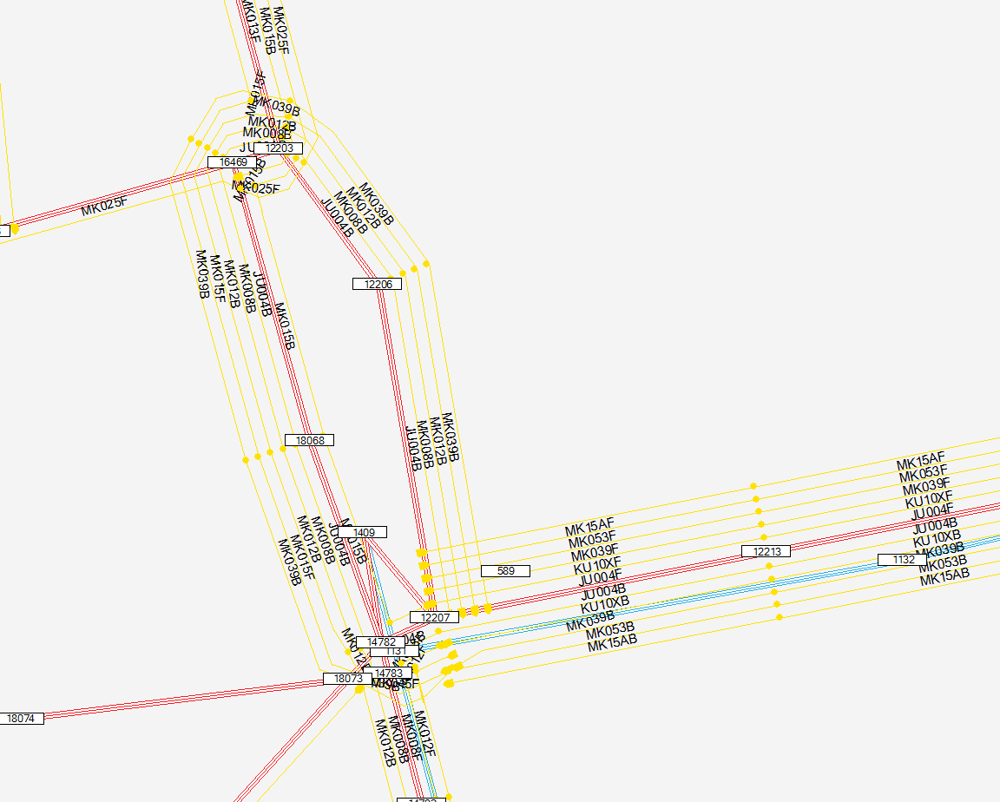

into this:

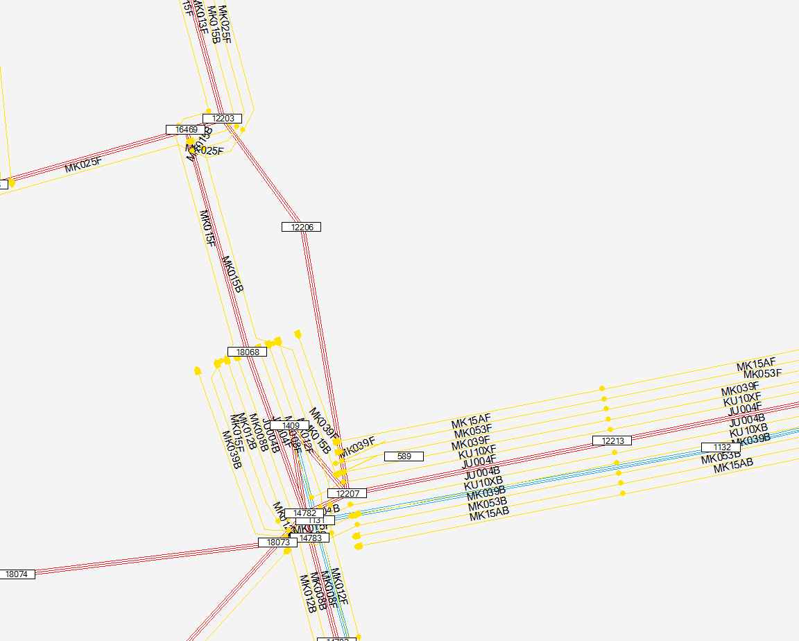

and this:

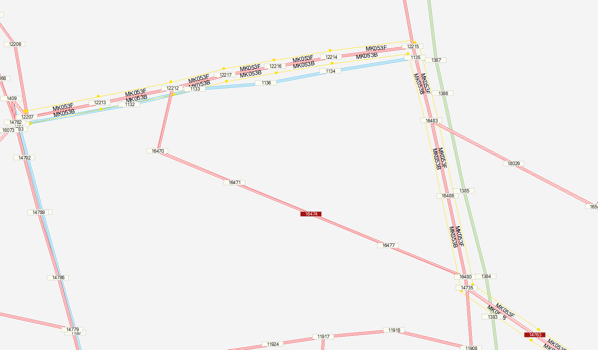

into this:

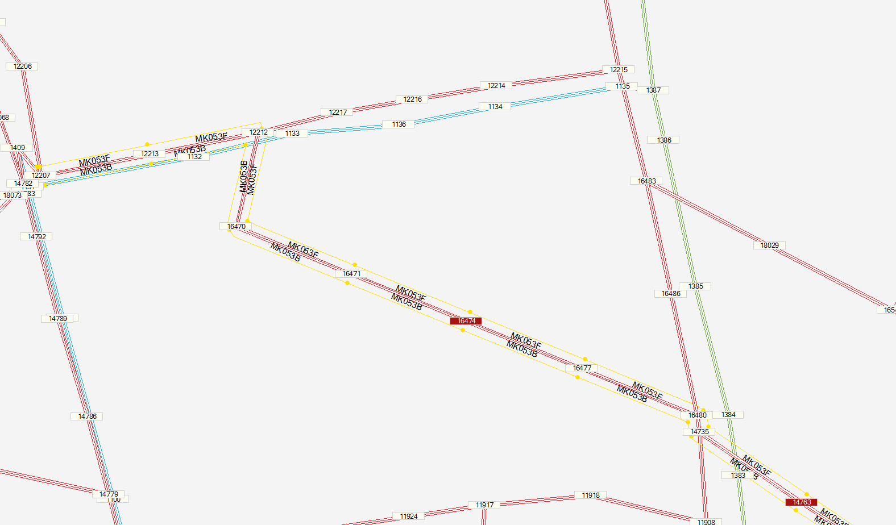


###Cones

Creates fare integration cones (mini terminals) to charge on auxiliary transit links:

- Given:
	- an integration fare table, like this:
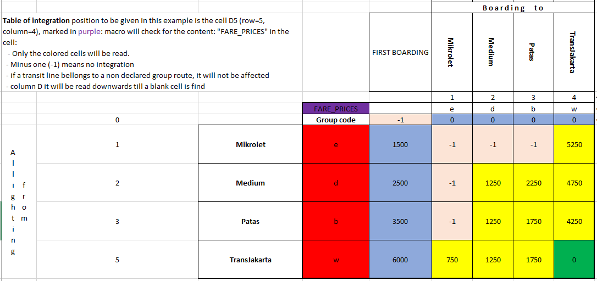

	- And a list of the group each transit line belongs to -- either by ut1, ut2, ut3, mode or by a table as bellow:


	- the auxiliary free of charge mode (walking mode)
	- the auxiliary 'charging mode'
	- \[cone height for drawing\]
	- \[penalty cost for transfer\]

- Will create cones for all stops where a bus bellonging to a group with fare integration stops, with auxiliary mode given bellow and price is placed in ul3, transforming
the network from this (each fare group is represented by one color):

from this:

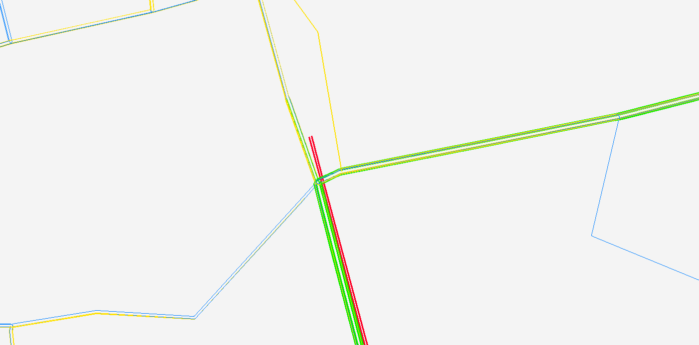

to this:

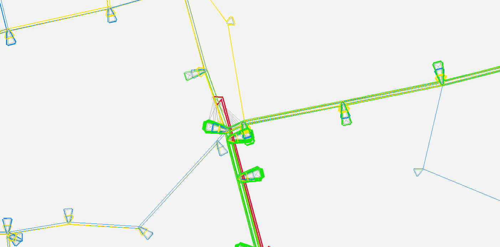


- Where:
    	- New nodes will try to have the same number end (above 100,000) of the root node they are expanding to charge connections
    	- uses the 700-900 range for types of the new links
    	- buses only stops inside the cones
	- user can only reach stop, thru auxiliary transit modes.
		- from a root node on the street, where ul3 in the link gives the full price for first boarding
		- from a alighting only stop node, where ul3 in the link states the fare integration price

Image bellow shows an example (from Jakarta, left-handed traffic), showing modes and ul3:

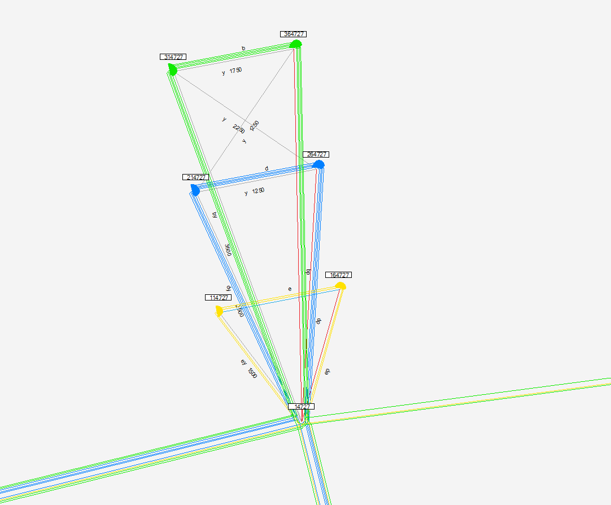


- It is possible to inform that two points appart from each other may also be considered for fare integration
	- informing an special link type on the network that connects this 2 stops
	- and providing an equivalence between  walking distance and fare, so a walking cost can be included when making cones between two stops

with this special link, instead of this:

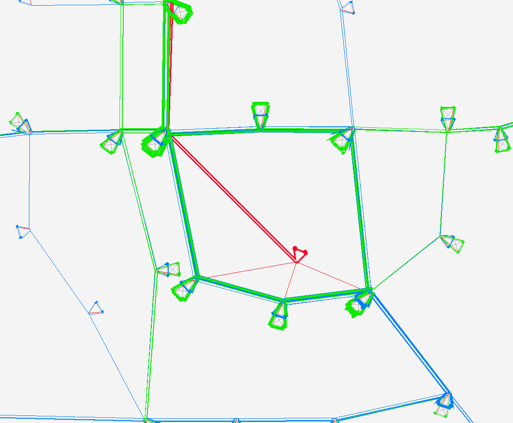


the cones will be created like this:


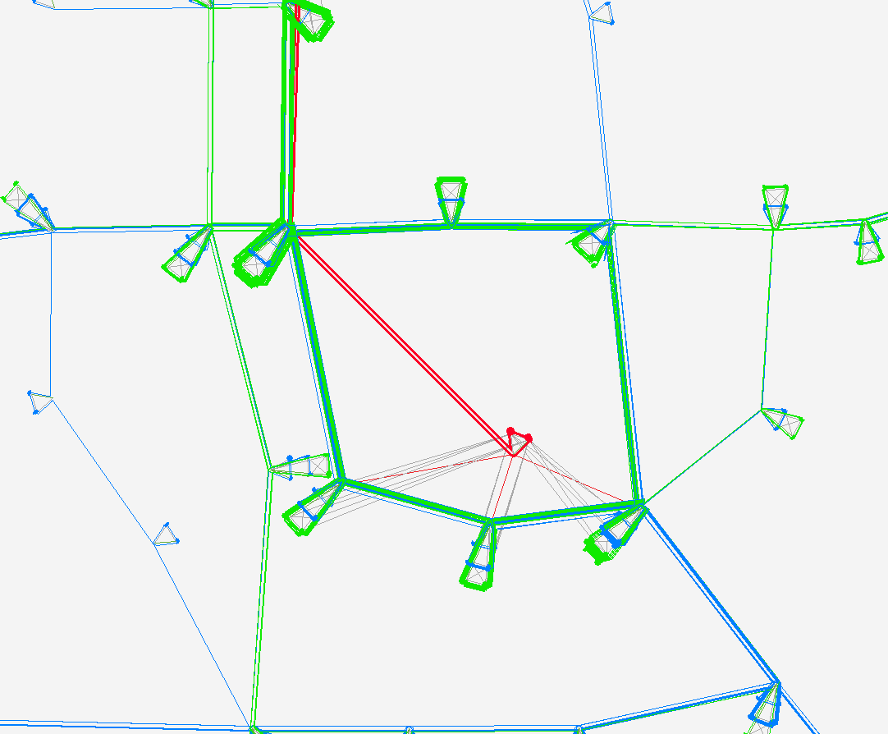


This solution was applied to large networks (Rio de Janeiro amd Belo Horizonte) with up to 18 fare groups, after selection of only relevant stops:
	- first and last encounter of any transit lines
	- closer stop between a centroid and a transit line passing within a radius of 2 km of the centroid (walking was allowed all over the network)


In Rio, an experimental solution was used to restrict only one transfer, but to partial network, because at the time there were stronger transit segments limitations
 (and our licence key was not big enough):

-  Every line was doubled: one representing first boarding:
	- first group, representing first boarding:
		- allowed boarding for free every root stop node
		- was detoured to the right leg of the cone
		- alighting was only allowed inside the cone, from where:
			- first boarding price was charged to allow user go back to the street
			- integrated fare was charged for user move to any node on the left side of the cone
	- second group to the left side, represented the line carrying the passengers that already transfered:
		- entered the left side of cone
		- allowed boarding only inside the cone
		- allowed alighting for free on every root stop node
	
This experimental solution is available for this organized implementation as well, by marking an X on row 16,  comparison between the results in our testing for Jakarta 2004 Network is shown here:

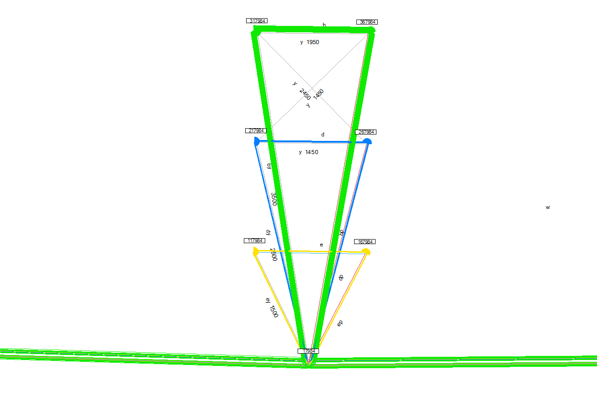
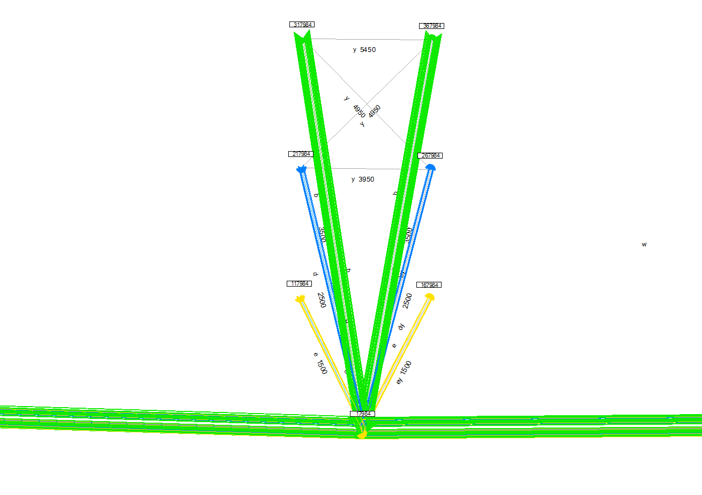


<a name="play-with-code"></a>
## Playing with code:
Every module has a few Public variables (vectors) that it is responsible for computing, even functions not used outside are public (if you need disambiguation you use the format Module.Function).

### Module "Basic Network"
This module holds the code that deal with network parameters, distance and find (network elements) tools. It is the responsible for maintaing the consistency of the network, while 
making requested changes to its functions.

It holds the main types, points (=nodes), links and routes, and broadcasts the elements of these types that make the network to the other routines

### Module "Emme"
This module holds the functions that deal with reading and writting emme files, querying and changing properties
that are important to write on the output files.

### Module "Text"
Deals basically with parsing and substitution of strings. As parsing is implemented, all functions return the number of elements parsed on a string and let the
parsed result in a Public vector called SplitWord (instead of returning it as a Variant)... there is also a SplitWordB, for use when you want to parse something that is 
in SplitWord, so it is not needed to save it.

### Module "Sort"
It has HeapSorts implemented, it follows the same idea of the parser:
- There is a public vector variable (in fact two of them: one is numerical (single) and the other alfa-numerical (string)) to exchange information with the sorting function.
The calling routine must fill these vectors, than inform up to what position it was done (in var Public NtoSort), then call the function to sort that vector up to that position.

### Modules "Cone" and "Lines Mover"
Have routines specific to those tools. Module "Dialog" has also tools  to assist this 'spreadsheet interface' in the selection of files and spreadsheets that will be used as parameters
for this two routines. New tools may follow the same pattern.


<a name="module-modules"></a>
### Module "Modules"
This module holds code to export and import the own modules in VBA. This demands that you enable:

- Security settings (on Excel: "File... Options... Trust Center... Trust Center Settings... Macro Settings" or more directly on "Developer... Macro Security...") to \[v\] 
Trust access to the VBA project object model
- Microsoft Visual Basic For Applications Extensibility 5.3. (on IDE: "Tools... References...)

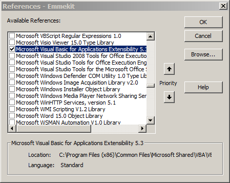

While this are enabled you must be aware of the origins of macros you run... a good explanation of what is going on done by Chip Pearson [here](http://www.cpearson.com/excel/vbe.aspx).

Once you do this, you can export all modules running the Sub export_all_my_basic_modules() (and adding the names of your created modules to Sub load_names_of_modules()

##Inspirational Garbage
In the file with the same name you can find a considerable ammount of things not cleaned up and not well organized is huge:
- There is some fairly well documented classes


<a name="first-time-user"></a>
## If you are a first time user of VBA:

For now you just should download the ".xlsm" file and, _after learning the bellow_, play with it.

Visual Basic for Applications is basically a simplified Visual Basic interpreter (and run-time) embedded in MS-Office.
It has a very convenient and easy-to-learn-and-use Integrated Development Enviroment (IDE). This means you can write programs inside
 the Excel (and other office files) to automate the use of that application (and others). This programs are called MACROS, as are EMME macros.

Before MS-Office 2007, simple spreadsheet files were all ".xls"  After 2007, they were divided as follows:
- ".xls" became ".xlsb" (b for binary), even though ".xls" and ".xlsb" are internally different, they are both binaries, and:
	- both can have macros embedded (or not)
- ".xlsx" and ".xlsm" are a 'tree of [zipped XML files](#xmlfiles)', they are usually larger than the equivalent binaries and:
	- ".xlsx" do not have macros:
		- they are called macro free workbooks
		- if you save an ".xlsx" after you created a macro inside it, Excel will throw it away, after giving you proper warning and suggesting other formats to save it.
	- ".xlsm" files are "macro-enabled workbooks"
		- this can have macros embedded (or not)
		
It does not matter which fomat (even if it is called macro-enabled), when you oppen a file with embbeded macros, depending on your 'macro security settings' you may:

- be asked if you want-to enable macros
- have macros ignored
- have macros automatically enabled (this has security concerns, because macros can change things beyond the file scope and beyond the application (Excel scope),
 even when openning the file)

To set this go to "File... Options... Trust Center... Trust Center Settings..." In Trust Center go to Macro Settings... and choose the suitable option
(which is likely to be 'Disable all macros with notification')


<a name="xmlfiles"></a>
* XML are HTML-on-steroids, but still text files: to understand this better you should try to rename an ".xlsx" or a ".docx" to _".zip"_ 
(possible only after unckecking the settings of your Windows Explorer in \[ \] 'Hide extensions of known file types' and disregard the warning 
that doing such a thing can affect how things work), unzip it and explore its contents.


An exercise to understand how this works:

- First, get the "Developer Ribbon" on your Excell
in File... Options... Customize Ribons... on the right side, check the box ''Developer''


- Now you should have a new Ribbon on your Excel (Developer), where you will find the "Record Macro" button...

- Get yourself a new empty file to play with, and hit the button, fill the form about the macro you are about to create and hit "OK": after you do 
Excel will record your moves (and write the code for that in a place where you can change it and call it for execution)
until you hit the record button again (that shall be renamed to stop recordding).
	- Do a few operations: write text, change cell collors, border.
	- Hit stop recording button (that is both on the developer Tool, and (in Excel 2013) appears again on the bottom left, diguised as a square...


- To see this work, undo what you did and execute the macro by clicking in the second button of the Developer Ribbon "Macros".
- To see the code, which you should do after recording a few more macros, use the first button of that Ribbon "Visual Basic", (equivalent 
to <kbd>Alt</kbd>+<kbd>F11</kbd>. You will be in the Visual Basic IDE, as explained bellow


To shift to the IDE in Excel (and shift back to Excel), press <kbd>Alt</kbd>+<kbd>F11</kbd>.

Usually, the uper-left corner will show you the Project Explorer: a typical Windows' folder structure,
 showing existing open workbooks and VBA projects associated with each one. If you don't see it, press  <kbd>Cltrl</kbd> + <kbd>R</kbd>.

There can be code written ''inside'' the workbook (inside each worksheet), to each project you can add forms and modules


To Execute a Macro (Sub) you can either, select it from Excel or place the cursor on its code on the VBA and hit the play button (same as <kbd>F5</kbd>),
 but the most interest thing to do is to hit F8 and execute it step by step, at first (click in the Debug Menu to see your otpions to run the code)

Welcome to a new world!

After while using the VBA IDE you will want to disable: Tools... Options... "Auto Sintax check". When sintax is wrong code lines goes red anyway.

Another useful thing is to click with the right button in th menu bar and select Customize... Edit... and find the commands (buttons) 'Comment blocks' and 
'Uncomment blocks' and drag them to the tool bar and the Edit Menu, they are not shown anywhere by default and are very useful.


_OBs.:_ to deal with EMME input without problems you must set your Excel and your Windows to use "dots" as decimal separator.
Over the years I've learn that is easier to go back and forth changing this settings, based on your needs, than having your macros to deal with it.
(place settings for Windows on the Start Menu.)
VBA does not respect the Excel settings for digits and thousand separator, so make sure you set Windows to 
use . (dot) for decimal digits and , (comma) for thousand separator, so outputs are recognized by EMME.


